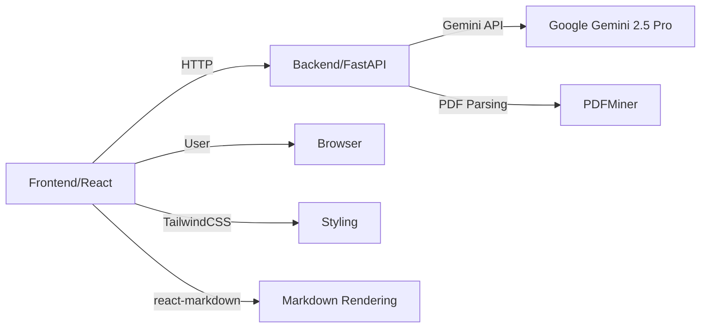
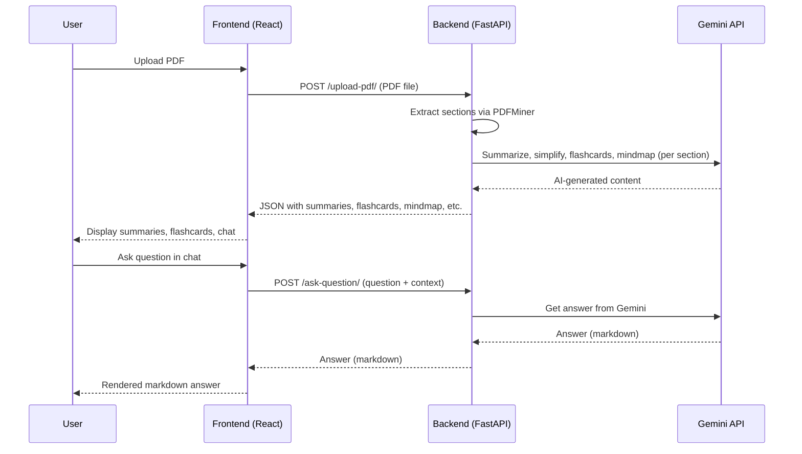

# 📄 AI Research Paper Simplifier

A full-stack AI-powered platform to **upload research papers (PDF)** and instantly get:
- ✨ Section-wise summaries
- ✨ Simplified explanations
- ✨ Flashcards for revision
- ✨ Chat-like Q&A powered by Gemini 2.5 Pro

Built for **Data Hack by MLH** with **React + TypeScript + Vite** (frontend) and **FastAPI** (backend), leveraging Google Gemini for advanced AI features.

---

## 🚀 Features

- **PDF Upload:** Drag & drop or select a research paper PDF.
- **Section Summaries:** Get concise bullet-point summaries for each section.
- **Simplified Text:** AI-generated, student-friendly explanations.
- **Flashcards:** Auto-generated Q&A flashcards for revision.
- **AI Chat:** Ask questions about the paper in a chat interface, powered by Gemini 2.5 Pro.
- **Modern UI:** Responsive, clean, and easy to use.

---

## 🖥️ Tech Stack

| Layer      | Technology                                      |
|------------|-------------------------------------------------|
| Frontend   | React, TypeScript, Vite, TailwindCSS, react-markdown |
| Backend    | FastAPI, Python, python-dotenv, pdfminer, requests |
| AI         | Google Gemini 2.5 Pro API                       |

---

## 🗂️ Project Structure



```
airesearch/
├── backend/
│   ├── main.py
│   ├── gemini_utils.py
│   ├── pdf_utils.py
│   ├── requirements.txt
│   └── .env
└── frontend/
    └── myairesearc_project/
        ├── src/
        │   ├── components/
        │   │   ├── FileUpload.tsx
        │   │   ├── SummaryView.tsx
        │   │   ├── Flashcards.tsx
        │   │   ├── MindMap.tsx
        │   │   ├── QnA.tsx
        │   │   └── ChatGemini.tsx
        │   ├── App.tsx
        │   └── index.css
        └── ...
```

---

## ⚡ Quick Start

### 1. Clone the Repository

```bash
git clone https://github.com/yourusername/airesearch.git
cd airesearch
```

### 2. Backend Setup

```bash
# MacOS
cd backend
python3 -m venv venv
source venv/bin/activate
pip install -r requirements.txt


# Windows
python -m venv venv

venv\Scripts\activate
pip install -r requirements.txt
```

- Create a `.env` file in `backend/`:
  ```
  GEMINI_API_KEY=your_gemini_api_key_here
  ```

- Start the FastAPI server:
  ```bash
  uvicorn main:app --reload
  ```

### 3. Frontend Setup

```bash
cd ../frontend/myairesearc_project
npm install
npm run dev
```

- Visit [http://localhost:5173](http://localhost:5173) in your browser.

---

## 🧠 How It Works



---

## 📝 Customization

- **Change AI Model:** Edit `GEMINI_URL` in `backend/gemini_utils.py` to use a different Gemini model.
- **Styling:** Modify `index.css` or use Tailwind classes for custom UI.
- **Add Features:** Extend components or backend endpoints as needed.

---

## 🤖 Environment Variables

| Variable         | Description                |
|------------------|---------------------------|
| GEMINI_API_KEY   | Your Google Gemini API key|

---

## 🧩 Dependencies

- **Frontend:**  
  `react`, `typescript`, `vite`, `tailwindcss`, `react-markdown`
- **Backend:**  
  `fastapi`, `uvicorn`, `python-dotenv`, `pdfminer.six`, `requests`

---

## 📚 License

MIT License

---

## 🙏 Acknowledgements

- [Google Gemini](https://aistudio.google.com/)
- [FastAPI](https://fastapi.tiangolo.com/)
- [React](https://react.dev/)
- [Vite](https://vitejs.dev/)
- [Major League Hacking (MLH)](https://mlh.io/)


## Contribution

We welcome contributions from the community! To contribute:

1. **Fork the repository** and create your branch from `main` or the latest feature branch.
2. **Clone your fork** and set up the project locally.
3. **Make your changes** (code, tests, etc.).
4. **Test thoroughly** to ensure nothing is broken.
5. **Commit and push** your changes to your fork.
6. **Open a Pull Request** with a clear description of your changes and reference any related issues.

---

> **Made with ❤️ for Data Hack by MLH and AI-powered!**